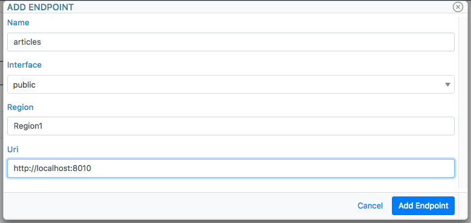
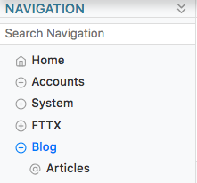
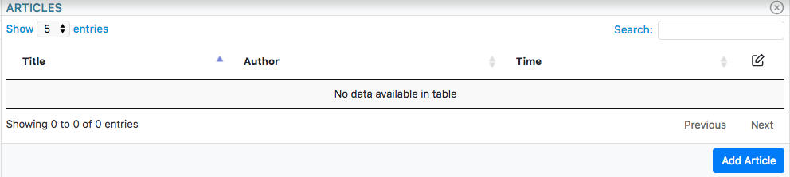
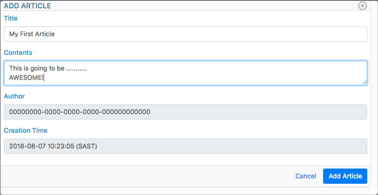

Getting Started with your first Tachyonic Project
=================================================

------------
Introduction
------------
In this tutorial we illustrate how easy it is to plug into the Tachyonic Framework. With a few lines of python code,
you will soon be up and running with your own scalable production-ready orchestration system. This includes
a database, REST API, and Web UI!

For the purposes of this tutorial, we will create a Python package called ``articles``, that will enable users
of the Tachyonic System to Create, Read, Update and Delete (CRUD) short articles, similar to blog posts.

Although a REST API is not nessecarily required for such an application, we show how to interact with the database
from the WEB UI through the REST API to illustrate the distributed capability of Tachyonic Projects. This shows
how you could deploy the WEB server on a different server than the database, and build your own API for interaction. One
would of course do this for security and scalability reasons, however, in this tutorial we merely illustrate the
concept, but still use only one server to keep thinks simple.

-------------
Prerequisites
-------------

Server
------
In order to complete this tutorial, you'll need a web server. In particular, one that is WSGI compliant. Any OS will do,
but for this tutorial we'll be using UBUNTU with
`Apache2 <https://www.digitalocean.com/community/tutorials/how-to-install-the-apache-web-server-on-ubuntu-18-04>`_
and it's mod_wsgi addon (``apt-get install libapache2-mod-wsgi-py3``). Luxon depends on a couple of 3rd
party python libraries [#luxondep]_, that in turn have some other requirements. As such, you'll also require the
following

.. code:: bash

    $ apt-get install libapache2-mod-wsgi-py3
    $ apt-get install libcurl4-openssl-dev libssl-dev

Python
------
All of the Tachyonic Projects are written in python, so of course you'll need that. Python 3.5 or higher is required,
we recommend Python 3.6. We're also going to use Python's pip to install our package, so

.. code:: bash

    $ apt-get --assume-yes install python3 python3-pip

Database
--------
At the time of this writing, Tachyonic Project supports sqlite3 and Mysql. We will be using MySQL.

.. code:: bash

    $ apt-get install mysql-server

Infinitystone + Photonic
------------------------
Since we will be adding onto Photonic, we require a running instance of it, along with its dependacy which is
infinitystone. They each have their own installation instructions, which can be found on their respective
documentation pages:

* infinitystone: `<http://tachyonic.org/sphinx/infinitystone/development/install.html>`_.
* photonic: `<http://tachyonic.org/sphinx/photonic/development/install.html>`_.

Of course, they need to be deployed on the server, refer to the :ref:`deployment_guide`. For this tutorial, we
will be using mysql, so be sure to follow the mysql deployment guide.

A little bit of knowledge of luxon
----------------------------------
Not an exact requirement per se, but a little bit of knowledge is never a bad thing. If you have gone through the
`Luxon Tutorials <http://tachyonic.org/sphinx/luxon/latest/tutorials/index.html>`_, then you will have a decent
understanding of the luxon basics, and won't see a lot of the things here for the first time. This might make this
tutorial less daunting.

----------------------------
Step 1: Prepare your package
----------------------------
Luckily most of the work has been done for you already, and this process is pretty automated. Follow the instructions
to `clone the template project <https://github.com/TachyonicProject/template-project/blob/latest/README.rst>`_ to your
server. Instead of ``my-project``, let's call this package ``articles``.

Once you have completed this process, install your package by running inside the directory where you cloned:

.. code:: bash

    $ pip3 install -e .

We are using pip's ``-e`` switch so that we can modify the code in the cloned directory, without having to
re-install the package after every change.

-------------------------
Step 2: Create your model
-------------------------

In true `MVC <https://en.wikipedia.org/wiki/Model–view–controller>`_ fashion, luxon provides us with models that will
be used to create the database tables.

We'll use a database table called ``tachyonic_article``, so in the ``articles/models`` directory, create ``articles.py``
with:

.. code:: python

    from uuid import uuid4

    from luxon import register
    from luxon import SQLModel
    from luxon.utils.timezone import now

    from infinitystone.models.users import infinitystone_user

    @register.model()
    class tachyonic_article(SQLModel):
        id = SQLModel.Uuid(default=uuid4, internal=True)
        title = SQLModel.Fqdn(null=False)
        contents= SQLModel.LongText()
        author = SQLModel.Text(readonly=True)
        creation_time = SQLModel.DateTime(default=now, readonly=True)
        primary_key = id
        author_user_ref = SQLModel.ForeignKey(author, infinitystone_user.id)

Each Article entry will have a unique ID (uuid), which will act as the primary key, a title, author and contents. We
will also record the time the article was created.

While we are dealing with database tables, let's modify the *articles/settings.ini* file to indicate the correct
database credentials:

.. code::

    [database]
    type=mysql
    host=localhost
    username=tachyon
    password=puma
    database=tachyon

Be sure to use the same MySQL credentials as your Infinitystone installation.

.. need to have infintistone also use mysql for this foreign key, and same db must be used, so
    mysql commands:
    create database tachyonic;
    CREATE USER 'tachyonic'@'localhost' IDENTIFIED BY 'puma';
    GRANT ALL PRIVILEGES ON tachyonic.* TO 'tachyonic'@'localhost';
    flush privileges

-----------------------------
Step 3: Create your API views
-----------------------------

We'll use this model in our API views.
In the *articles/views* directory, create a file called *articles.py* with the contents:

.. code:: python

    from luxon import register
    from luxon import router
    from psychokinetic.utils.api import sql_list, obj

    from articles.models.articles import tachyonic_article

    @register.resources()
    class Articles(object):
        def __init__(self):
            router.add('GET', '/v1/article/{id}', self.article)
            router.add('GET', '/v1/articles', self.articles)
            router.add('POST', '/v1/article', self.create)
            router.add(['PUT', 'PATCH'], '/v1/article/{id}', self.update)
            router.add('DELETE', '/v1/article/{id}', self.delete)
    
        def article(self, req, resp, id):
            return obj(req, tachyonic_article, sql_id=id)
    
        def articles(self, req, resp):
            return sql_list(req, 'tachyonic_article', ('id', 'title', 'creation_time'))
    
        def create(self, req, resp):
            article = obj(req, tachyonic_article)
            article.commit()
            return article
    
        def update(self, req, resp, id):
            article = obj(req, tachyonic_article, sql_id=id)
            article.commit()
            return article
    
        def delete(self, req, resp, id):
            article = obj(req, tachyonic_article, sql_id=id)
            article.commit()
            return article

.. note::

    With the views as shown above, all users will be able to create, update and delete articles. Typically, one would
    want to limit this to only certain users. This can easily be achieved by means of luxon
    `policy <http://tachyonic.org/sphinx/luxon/latest/framework/policy.html>`_
    `tags <http://tachyonic.org/sphinx/luxon/latest/framework/routing.html#luxon.core.router.Router>`_.
    This is beyond the scope of this tutorial, so to keep things simple, we chose to not protect views with policies.

Notice in the ``sql_list`` function's attributes, you can limit/specify the fields to be returned.

Now that we have created our views, let's import it in our *articles/views/__init__.py*:

.. code:: python

    import articles.views.articles

Our *wsgi.py* file imports ``articles.app``, which in turn imports ``articles.views``. This last import completes the chain of imports.

----------------------------
Step 4: Create your UI views
----------------------------

We will make use of some jinja2 templates to render the content for us. In the *articles/ui/templates* directory,
add a file called *list.html* which we will use to list all the articles. Populate it with:

.. code:: jinja

    
    
    <table class="display" data-url="/v1/articles" data-endpoint="articles" width="100%">
        <thead>
            <tr>
                <th id='title'>Title</th>
                <th id='creation_time'>Time</th>
                <th data-href="/articles" data-modal width="2rem">
                    
                </th>
            </tr>
        </thead>
    </table>
    
    
    <a class="btn btn-primary" data-modal href="{{APP}}/articles/add">Add Article</a>
    

Here you can see we extend the photonic view.html template, so the html table will be turned int a jquery datatable.
The ``data-url`` entry specifies where the datatables AJAX call must end up at [#apiproxy]_ in order to populate the table,
and the ``data-endpoint`` values says to use the ``articles`` endpoint.

In the same directory, let's create a template to display an article. Create a file called *view.html* and
populate it with:

.. code:: jinja

    
    
    <form method='post' enctype="multipart/form-data" disabled>
        {{ form }}
    </form>
    

    
        <a href="#" onclick="close_window();" class="btn btn-default">Back</a>
        <a href="{{ APP }}/articles/edit/{{id}}" class="btn btn-primary">Edit</a>
    

Same goes for *add.html*:

.. code:: jinja

    

    
        <form id="form" method='post' enctype="multipart/form-data">
            {{ form }}
        </form>
    

    
        <a href="#" onclick="close_window();" class="btn btn-default">Cancel</a>
        <a href="{{ APP }}/articles/add" data-form="form" class="btn btn-primary">Add Article</a>
    

and *edit.html*:

.. code:: jinja

    

    
        <form id="form" method='post' enctype="multipart/form-data">
            {{ form }}
        </form>
    

    
        <a href="{{ APP }}/articles/{{id}}" class="btn btn-default">Cancel</a>
        <a data-confirm="Delete Article?" data-close href="{{ APP }}/articles/delete/{{id}}" class="btn btn-danger">Delete</a>
        <a href="{{ APP }}/articles/edit/{{id}}" data-form="form" class="btn btn-primary">Update</a>
    

Now that we have all our templates set up, we can create some routes that load views that make use of these templates.
Create a file in the *articles/ui/views* directory called *articles.py* with the contents:

.. code:: python

    from luxon import g
    from luxon import router
    from luxon import register
    from luxon import render_template
    from luxon.utils.bootstrap4 import form
    
    from articles.models.articles import tachyonic_article
    
    g.nav_menu.add('/Blog/Articles',
                   href='/articles',
                   feather='at-sign')
    
    
    @register.resources()
    class Articles():
        def __init__(self):
            router.add('GET', '/articles', self.list)
            router.add('GET', '/articles/{id}', self.view)
            router.add('GET', '/articles/delete/{id}', self.delete)
            router.add(('GET', 'POST',), '/articles/add', self.add)
            router.add(('GET', 'POST',), '/articles/edit/{id}', self.edit)

        def list(self, req, resp):
            return render_template('articles.ui/list.html',
                                   view='Articles')

        def delete(self, req, resp, id):
            req.context.api.execute('DELETE', '/v1/article/%s' % id, endpoint="articles")

        def view(self, req, resp, id):
            article = req.context.api.execute('GET', '/v1/article/%s' % id, endpoint="articles")
            html_form = form(tachyonic_article, article.json, readonly=True)
            return render_template('articles.ui/view.html',
                                   view='View Article',
                                   form=html_form,
                                   id=id)

        def edit(self, req, resp, id):
            if req.method == 'POST':
                req.context.api.execute('PUT', '/v1/article/%s' % id,
                                        data=req.form_dict, endpoint="articles")
                return self.view(req, resp, id)
            else:
                article = req.context.api.execute('GET', '/v1/article/%s' % id, endpoint="articles")
                html_form = form(tachyonic_article, article.json)
                return render_template('articles.ui/edit.html',
                                       view='Edit Article',
                                       form=html_form,
                                       id=id)

        def add(self, req, resp):
            if req.method == 'POST':
                data = req.form_dict
                data['author'] = req.credentials.user_id
                response = req.context.api.execute('POST', '/v1/article',
                                                   data=data, endpoint="articles")
                return self.view(req, resp, response.json['id'])
            else:
                html_form = form(tachyonic_article, {'author':req.credentials.user_id})
                return render_template('articles.ui/add.html',
                                       view='Add Article',
                                       form=html_form)

Note the ``endpoint="articles"`` attribute when calling the psychokinetic api client.

---------------------------------------
Step 5: Deploy and run your Application
---------------------------------------

Let's assume we will be deploying in ``/var/www/articles``

.. code::

    $ cd /var/www
    $ mkdir articles
    $ luxon -i articles articles/

Create the articles database table:

.. code::

    $ luxon -d articles

Now we are ready to fire up the REST API portion of our application. We'll use gunicorn (``pip3 install gunicorn`` if
you have not already) via ``luxon -s``. Let's fire it up on TCP port 8010:

.. code::

    $ luxon -s --port 8010 articles

Now we are in the position to CRUD aricles via POST, GET, PUT/PATCH, and DELETE calls to the API on
http://localhost:8010/v1/articles.....

--------------------------------------------------------------------
Step 6: Add your application to your existing Tachyonic Installation
--------------------------------------------------------------------

This is done in two steps. We will add our:

#. API views as a Tachyonic Endpoint, and
#. UI views into our existing Photonic installation.

First, let's add the Endpoint.

Recall we are running our endpoint on localhost on TCP port 8010, and we refer to it as *"articles"*.
Log into your photonic UI, navigate to ``System -> Endpoints``, anc click on Add Endpoint.

Enter the details and hit ``Add Endpoint``.

That's it! Next up, we'll add the UI routes, views and menu items.

Navigate to your Photonic deployment directory, and update the wsgi.py file to import our UI view.
For example, if it was installed in */var/www/photonic*:

.. code:: bash

    $ cd /var/www/photonic
    $ echo "import articles.ui.views.articles" >> wsgi.py

And that's it! After a restart of your web server (eg ``service apache2 reload`` in the case of apache2) you will see
your new Menu entry in the Photonic UI:

And when you click on it, you see a list with no articles:

So let's create one:

Hit ``Add Article`` to save. This should load the view page. From here you can edit the article, and from the edit view
you may delete the article.

This concludes our tutorial on creating a Tachyonic Module.

.. rubric:: Footnotes

.. [#luxondep] To see all of these, refer to luxon's `install-requires.txt <https://github.com/TachyonicProject/luxon/blob/latest/install-requires.txt>`_ file.
.. [#apiproxy] In actual fact, the AJAX call is made to the photonic UI on ``/apiproxy``. This route simply proxies the request straight to infinitystone, or to whatever endpoint is specified.

